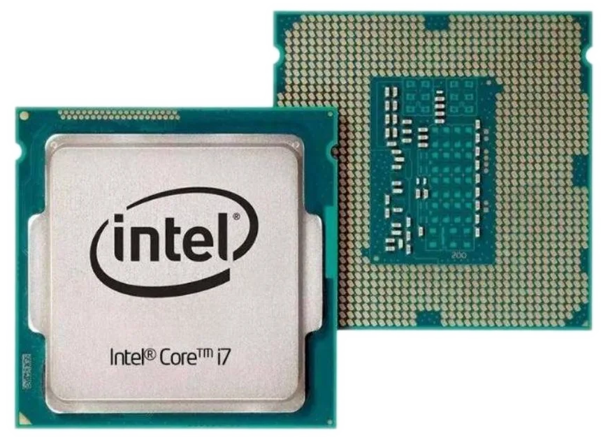

# Cookbook for Intel Platform Machines

<p align="center">
    
</p>

This cookbook provides a collection of recipes to help you get started with DeimOS for Intel x86-64 Platform based boards.

## Prerequisites

- [Gaia project Gaia Core](https://github.com/gaiaBuildSystem/gaia);

<p align="center">
    
</p>

## Build an Image

```bash
./gaia/scripts/bitcook/gaia.ts --buildPath /home/user/workdir --distro ./cookbook-intel/distro-ref-intel.json
```

This will build DeimOS for Intel x86-64 Platform.

## Supported Boards -> Machine

> ⚠️ As this grows we could change the machine name to a more generic name.

> ⚠️ x86 32bit is not supported.

| Board              | Gaia Machine Name   |
|--------------------|---------------------|
| x86-64 Intel/amd64 | intel               |
